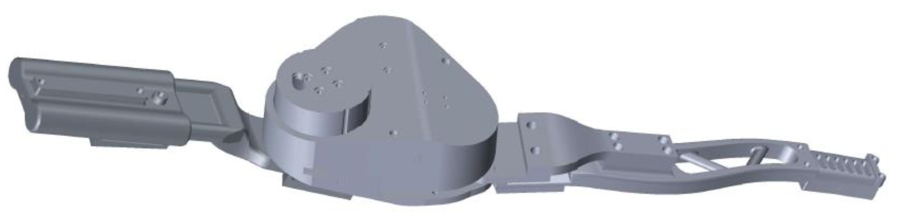
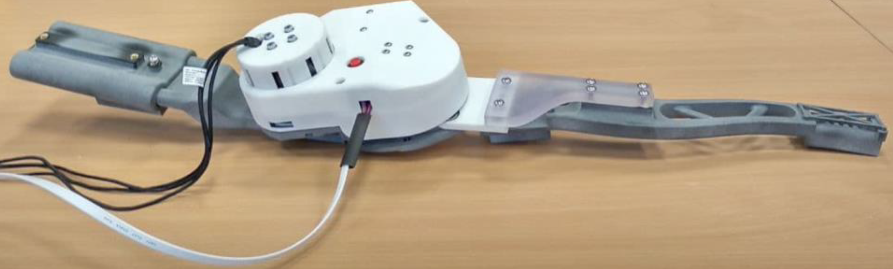
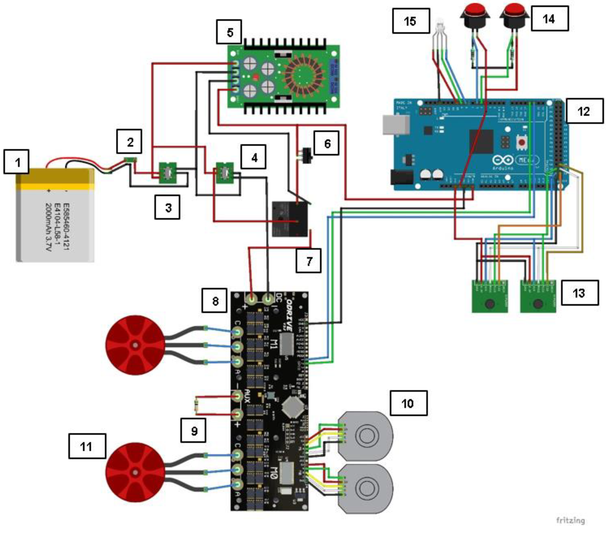
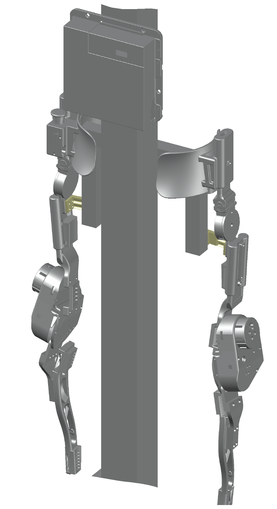
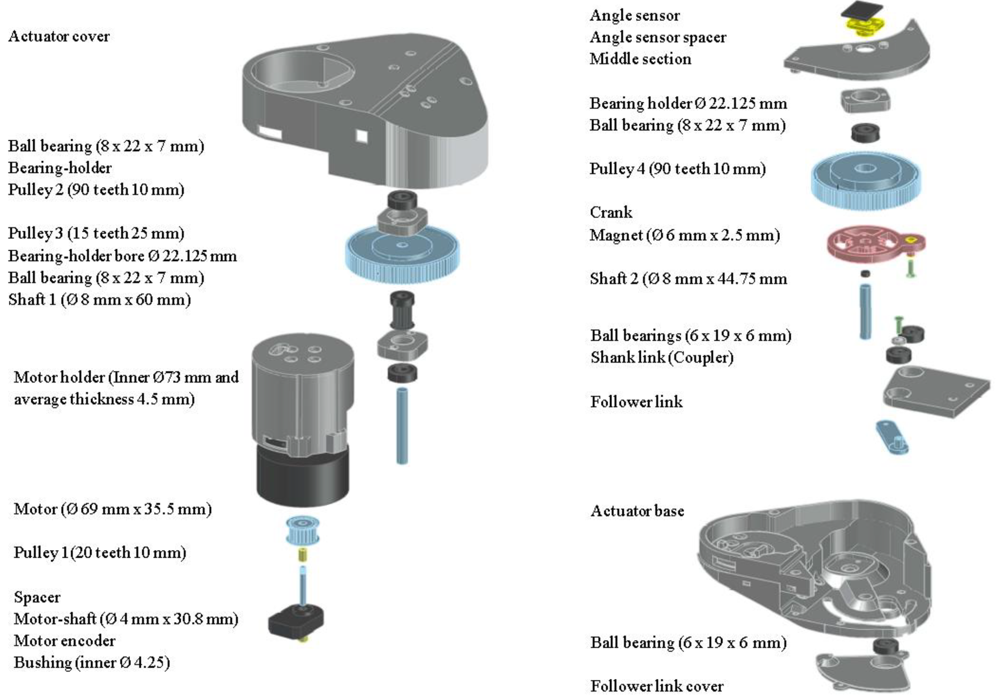
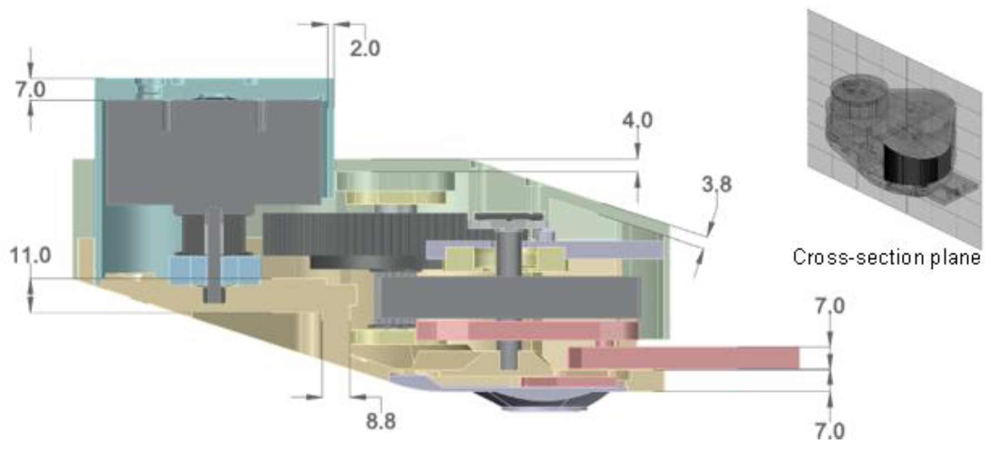
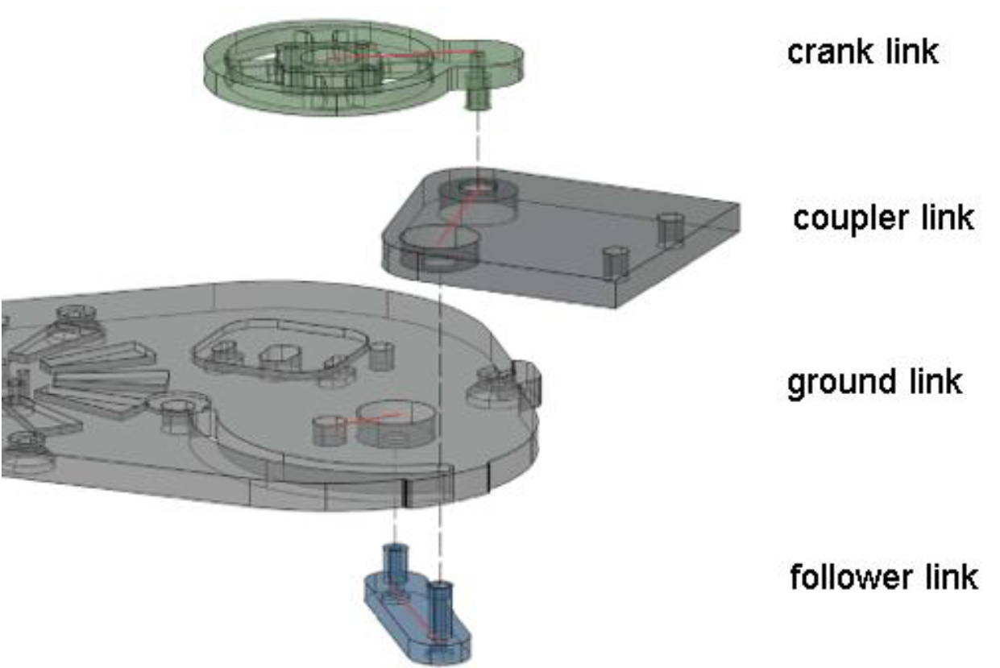
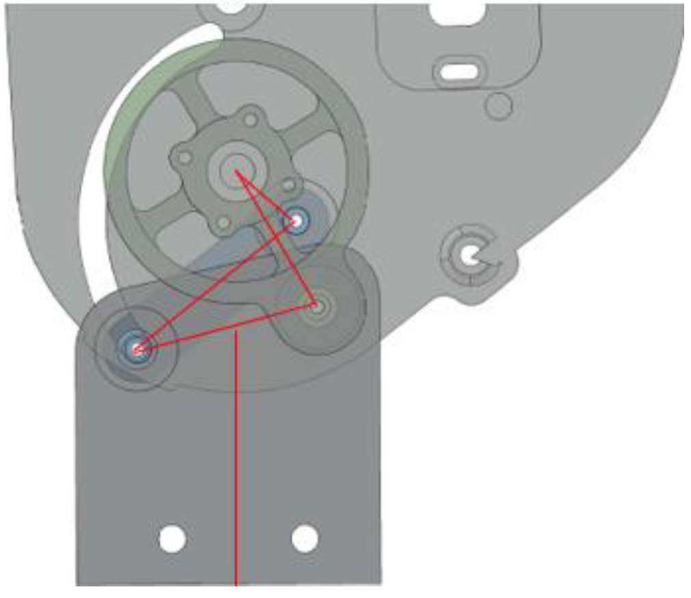
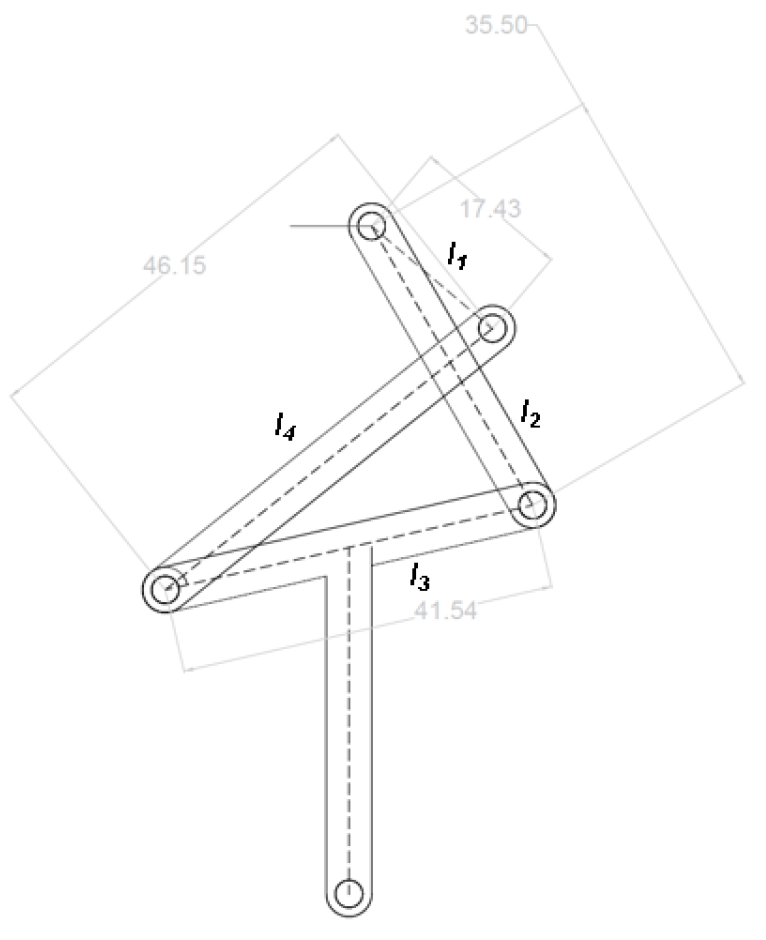
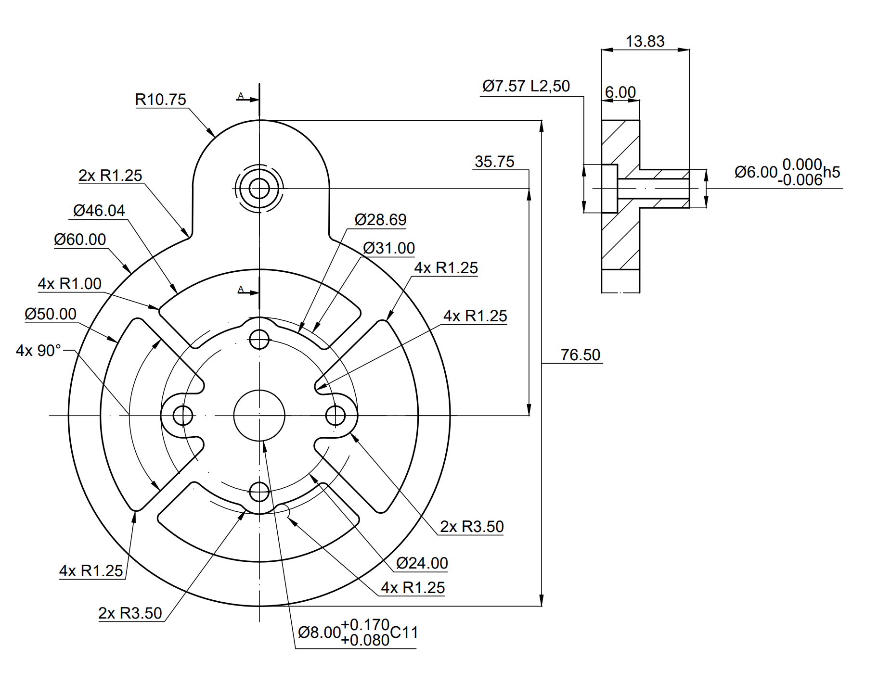

# ForCEs-Exoskeleton-Project
Project at Deggendorf Institute of Technology for the development of a lower-limb active exoskeleton.
Scientific publication about the exoskeleton can be found [here](https://doi.org/10.1109/CoDIT58514.2023.10284272).
The supporting Master Thesis work for the actuator development is available [here](docs/Masterarbeit_TCC_Aubeeluck.pdf).

  
  
<strong>Fig. 1: CAD model of complete exoskeleton.</strong>

  
  
<strong>Fig. 2: Actual exoskeleton.</strong>

## Goal of this Repository
To complement the publication titled ["Design and Development of a knee rehabilitation exoskeleton with four-bar linkage actuation"](https://doi.org/10.1109/CoDIT58514.2023.10284272), so that the experimental trials, as well as results are made available and can be reproduced independently. This work has been completed by several researchers at the DIT and crediting us for any use of the material here would be very much appreciated.
For the image/build file for the Raspberry Pi and additional work with AI Gait recognition, please contact us.

## Description
The goal of this project was to design and develop an exoskeleton that can be worn with higher levels of acceptance
from patients. In particular, the actuator has a unique four-bar-linkage design, with a conventional belt-and-pulley drive
that allows it match the polycentric rotation of the knee and be back-driveable. 
The Control System of the exoskeleton relies on the operation of multiple interfaces, mainly a core running on a central processor, 
in this case, a portable Raspberry Pi 4 model B (4 Gb). Arduino Microcontrollers were used for Data Acquisition and ADC.
No specific HMI exists for the use and operation of the exoskeleton. Since an ODrive v3.6 controller is used for the motor control,
most testing and interactions have been achieved through CLI and basic python scripts.
The support structure is created with topology optimization and a prototype was assembled with powder printed parts.

## Repository Structure:

Complete repository structure:

- **`forces-exoskeleton-project/`**: root directory.
    - **`cad_files/`**: See [Mechanical Components](#mechanical-components) below.
    - **`docs/`**: Contains documentation files and images.
        - **`images/`**
        - **`Masterarbeit_TCC_Aubeeluck.pdf`**: Supporting Master Thesis work for the actuator development.
        - **`Four_bar_linkage_and_freudenstein.pdf`**: Sketch depicting four-bar linkage parameters.
        - **`Exoskeleton Operation Documentation.pdf`**: General operation guide for microcontroller and odrive.
    - **`microcontroller_scripts/`**
        - **`libraries/`**: Dependencies to run the microcontroller scripts.
        - **`mega_main/`**: The main script that runs on 'Arduino Mega' microcontroller.
            - **`mega_main.ino`**
        - **`nano_code_left_leg/`**: The microcontroller script for left leg actuator and sensor.
            - **`nano_code_left_leg.ino`**
        - **`nano_code_right_leg/`**: The microcontroller script for right leg actuator and sensor.
            - **`nano_code_right_leg.ino`**
    - **`python_scripts/`**
        - **`four_bar_force_calculation.py`**: Input force and output force mapping.
        - **`odrive_calibration.py`**: ODrive motor calibration at start.
        - **`odrive_repeating_motions.py`**: BLDC cycling motion control.
        - **`transformation_of_four_bar.py`**: Input (Crank) angle and output (Coupler) angle mapping.
    - **`.gitsync.sh`**
    - **`README.md`**
   

## Electronic Components:

The circuit schematic for the exoskeleton control is illustrated in the figure below:

  
  
<strong>Fig. 3: Circuit Schematic for Exoskeleton</strong>

These are the components used:

| Part Number | Part Name                | Part Description                               |
|-------------|---------------------------|------------------------------------------------|
| 1           | Battery                   | 22.2 V, ~5000 mAh LiPo Battery                 |
| 2           | Fuse Holder               | Fuse rating > 8 A                             |
| 3           | On/Off Switch             | DPST or DPDT Switch rated at 10 A             |
| 4           | Emergency Switch          | DPST Emergency Switch at 10 A                 |
| 5           | DC-DC Step Down Converter | 22.2 V to 5 V, 4A XL4016 Converter             |
| 6           | Emergency Push Button     | Latching Push Button rated at 2 A             |
| 7           | Mechanical Relay          | Relay rated at 10 A                           |
| 8           | ODrive Motor Controller   | ODrive v3.6 Dual BLDC Motor Controller (24V, 6A) |
| 9           | Braking Resistor          | 50W 0.5Ω Braking Resistor                     |
| 10          | Motor Encoder             | AMT-102V CUI Incremental Encoder              |
| 11          | BLDC Motor                | T-Motor P60 340KV BLDC Motor                  |
| 12          | Microcontroller           | Arduino Mega 2560 Microcontroller (12V, 2A)  |
| 13          | Angle Sensor             | AS5048A Magnetic Angle Sensor                |
| 14          | Push Button               | Latching Push Button (2A)                     |
| 15          | RGB LED                   | Common Anode RGB LED                         |

## Mechanical Components:

Directory structure for CAD files:

- **`forces-exoskeleton-project/`**
    - **`cad_files/`**: Directory for CAD data.
        - **`actuator_4.0/`**: Contains STL for actuator parts.
        - **`actuator_assembly/`**: Contains Inventor (.iam) assembly data for the actuator.
        - **`exoskeleton_assembly/`**: Contains Inventor (.iam) assembly data for the exoskeleton and test-stand.
        - **`Actuator_4.0.stp`**: Actuator (Left and Right) .step data.
        - **`Complete_exoskeleton_with_test_stand.stp`**: Exoskeleton with test-stand .step data.
        - **`four_bar_linkage_and_freudenstein.dwg`**: AutoCAD drawing of four-bar linkage dimensions, based on Freudenstein Equations.

  
  
<strong>Fig. 4: Step file: Complete exoskeleton with test stand.</strong>

The actuator exploded view and cross-section are illustrated in the images below.
Parts were 3D-printed with SLS (EOS Selective Laser Sintering) and HP MJF (Multi Jet Fusion), as well as machined via 
conventional means.

  
  
<strong>Fig. 5: Exploded view of actuator and details of components.</strong>

  
  
<strong>Fig. 6: Cross-section view of actuator and details of components.</strong>

The four-bar-linkage is incorporated inside the actuator for a seamless design.

  
  
<strong>Fig. 7: Exploded view: Parts of the four-bar linkage.</strong>

  

    
    
<strong>Fig. 8: Links in the four-bar linkage.</strong>

  

  

    
    
<strong>Fig. 9: Four-bar linkage dimensions.</strong>

  

The torque sensor was machined via CNC-milling in Aluminum 7075. The dimensions for the torque sensor machining is shown below. 
A peak torque of 20 Nm is measurable within the safety limits of the torque sensing element.

  
  
<strong>Fig. 10: Torque sensor element dimensions</strong>

